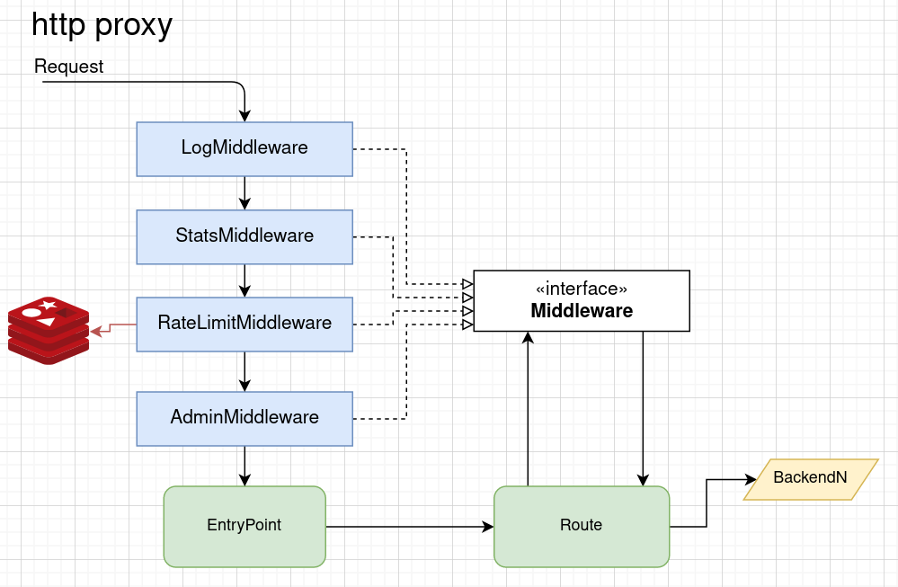

# Proxy server

<p align="center">

</p>

## Start all services
```shell
docker-compose.exe up --build --remove-orphans
```
## API Rest
### Update proxy config
```shell
curl --request PUT \
  --url http://localhost:8080/proxy-admin/config \
  --header 'Content-Type: application/json' \
  --data '{
  "routes": [
    {
      "pattern": "/backend1",
      "backends": [
        "http://backend1:3000"
      ]
    },
    {
      "pattern": "/backend2",
      "backends": [
        "http://backend2a:3001",
        "http://backend2b:3002",
				"http://backend2c:3003",
        "http://backend2d:3004"
      ]
    }
  ],
  "limits": [
    {
      "id": "1",
      "requestMin": 100000,
      "targetPath": "/backend2",
      "sourceIp": true,
      "headerValue": ""
    }    
  ]
}'
```
### Get current proxy config
```shell
curl --request GET \
  --url http://localhost:8080/proxy-admin/config
```
### Get proxy statistics
```shell
curl --request GET \
  --url http://localhost:8080/proxy-admin/stats
```
### Reset proxy statistics
```shell
curl --request DELETE \
  --url http://localhost:8080/proxy-admin/stats
```
### Get backend1
```shell
curl --request GET \
  --url http://localhost:8080/backend1
```
### Get backend2
```shell
curl --request GET \
  --url http://localhost:8080/backend2
```
## Test

https://github.com/codesenberg/bombardier
```shell
bombardier -c 10 -d 10m -l http://localhost:8080/backend2
```


